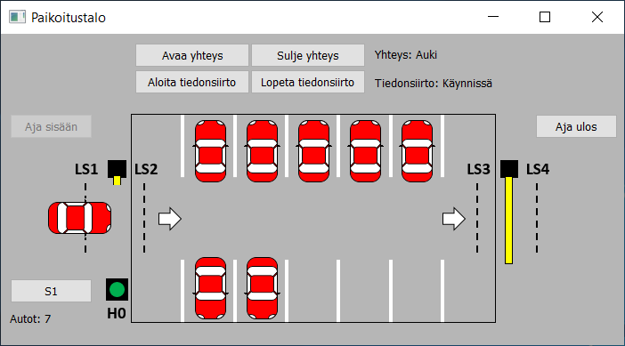

# Parking Garage Simulator

## Description

This Python GUI application simulates the operation of a parking garage which has 10 parking slots.

The application communicates with a TwinCAT 3 PLC program via Automation Device Specification (ADS) protocol.



Once a light sensor LS1 detects an arriving car, a motor M1 raises the barrier. After the barrier has been raised and the car has passed a light sensor LS2, the barrier is lowered and counter is increased by 1. Similarly, the lights sensors LS3 and LS4 detect when a car drives out from the parking garage. In this case the counter in decreased by 1. The motor M2 controls the barrier where the cars drive out.

If the parking garage is full, the barrier where the cars drive in is locked and a red indication light is on.

The button S1 resets the counter of the parking garage.

## Dependencies

The apllication uses [pyads](https://pypi.org/project/pyads/) and [PyQy5](https://pypi.org/project/PyQt5/) Python packages. You can install them with pip:

```
pip install pyads PyQt5
```

## TwinCAT I/O Configuration

Copy these inputs and outputs to your TwinCAT 3 project.

```
VAR_INPUT
	iLS1 AT%IX0.0: BOOL;		// Sisäänajopuomille tulleen auton havaitseva valokenno.
	iLS2 AT%IX0.1: BOOL;		// Paikoitustalon sisään ajaneen auton havaitseva valokenno.
	iLS3 AT%IX0.2: BOOL;		// Ulosajopuomille tulleen auton havaitseva valokenno.
	iLS4 AT%IX0.3: BOOL;		// Paikoitustalosta ulos ajaneen auton havaitseva valokenno.
	iM1ylhaalla AT%IX0.4: BOOL;	// Sisäänajopuomi on ylhäällä.
	iM1alhaalla AT%IX0.5: BOOL;	// Sisäänajopuomi on alhaalla.
	iM2ylhaalla AT%IX0.6: BOOL;	// Ulosajopuomi on ylhäällä.
	iM2alhaalla AT%IX0.7: BOOL;	// Ulosajopuomi on alhaalla.
	iS1 AT%IX1.0: BOOL;			// Paikoitustalon laskurin nollaus.
END_VAR
VAR_OUTPUT
	qM1ylos AT%QX0.0: BOOL;		// Sisäänajopuomin moottori M1 ylös.
	qM1alas AT%QX0.1: BOOL;		// Sisäänajopuomin moottori M1 alas.
	qM2ylos AT%QX0.2: BOOL;		// Ulosajopuomin moottori M2 ylös.
	qM2alas AT%QX0.3: BOOL;		// Ulosajopuomin moottori M2 alas.
	qH0 AT%QX0.4: BOOL;			// Merkkivalo: paikoitustalo on täynnä.
END_VAR
```

## Usage

Download and unzip the files. Open the Command Prompt in the folder where you unzipped the files and type
```
python application.py
```
to start the application.

Then,

1. Start the TwinCAT 3 project in Run Mode
1. Click "Avaa yhteys"
1. Click "Aloita tiedonsiirto"
1. Click "Aja sisään" to move the car to the top of the light sensor LS1
1. Click "Aja ulos" to move the car to the top of the light sensor LS3

In case you want to change your PLC code, simply click "Lopeta tiedonsiirto". After the new PLC code has been uploaded, click "Aloita tiedonsiirto" to start the reading and writing of the PLC variables.
